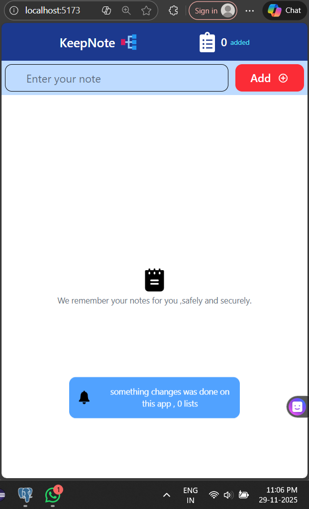
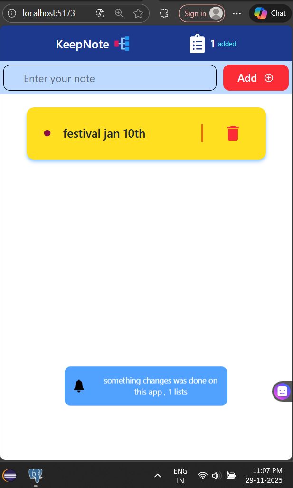
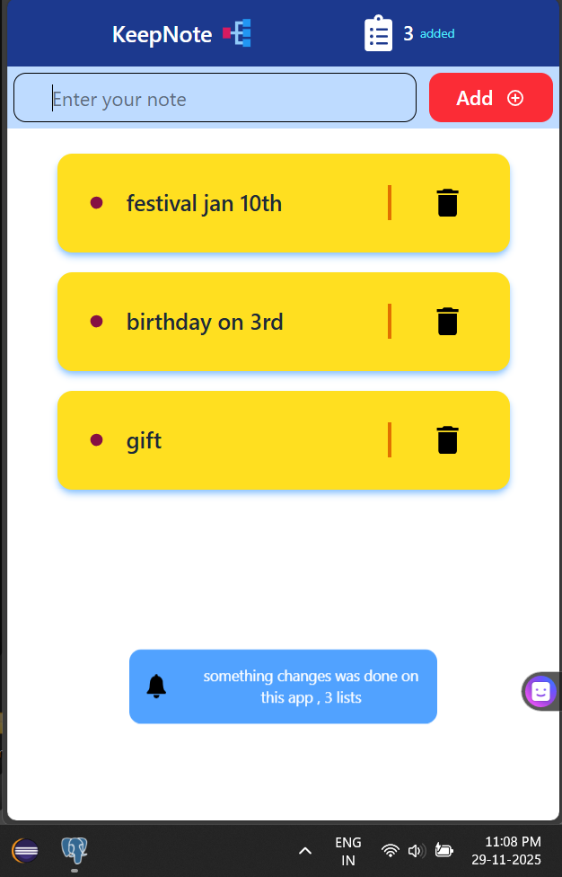
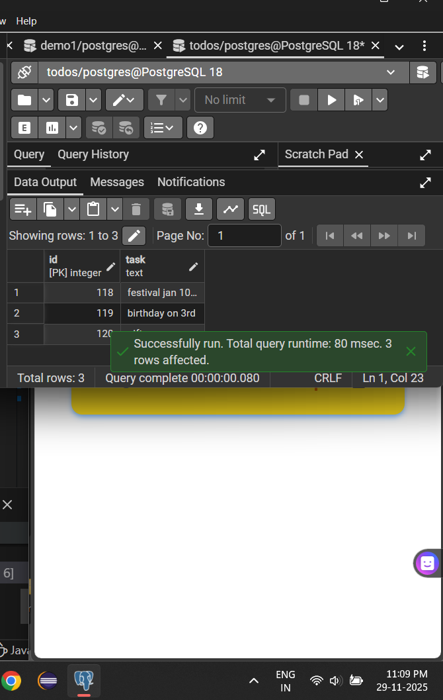

# 📝 note — React + Express + PostgreSQL + Zustand

A simple and clean **Note Manager** web application where users can:

✔ Add notes  
✔ Delete Notes  
✔ View live Note count  
✔ Store Notes in PostgreSQL  
✔ Automatically refresh UI  
✔ Smooth and modern UI with React + Tailwind  

This project uses:

- **Frontend:** React + Tailwind + Zustand  
- **Backend:** Node.js + Express  
- **Database:** PostgreSQL  
- **State Management:** Zustand  

---

## 🎥 Demo Video

Click below to watch the complete demo of the application:

👉 **[▶️ Watch Demo Video](./frontend/src/assets/noteDemo.mp4)**  
(Replace file path with your own uploaded file)

---

## 🎞 GIF Preview

(Place your converted GIF inside `assets/gifs`)

---

## 🖼 Screenshots

### 📌 Home UI  

### ➕ Add Note  

### 🗑 Delete Note  

### 🗄 PostgreSQL Database Table  

(Replace these files with your own screenshots)

---

## 🚀 Features

- ✨ Add Notes with clean UI  
- ❌ Delete Notes instantly  
- 🔄 Auto-refresh Note list  
- 🧮 Zustand-based Note counter  
- ⚡ Fast backend API using Express  
- 🗄 Persistent storage using PostgreSQL  
- 🎨 Fully responsive UI using Tailwind CSS  

---

## 🧩 Tech Stack

| Category | Technology |
|---------|------------|
| Frontend | React, Tailwind, Zustand |
| Backend | Node.js, Express.js |
| Database | PostgreSQL |
| Tools | Git, GitHub, Postman |
| Icons | react-icons |

---

## 📂 Folder Structure

